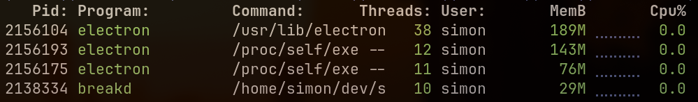

# breakd

Break reminders for Hyprland on Wayland.

## Why should I use this instead of Stretchly?

Stretchly: about 408 MB across three Electron processes. `breakd`: 29 MB.



This is why you should use my shit instead of Stretchly. xD

## Install

Install the AUR package and start the user service:

```bash
yay -S breakd
systemctl --user enable --now breakd.service
breakd status
```

`breakd` runs as your user. It does not need root access or access to `/dev/input`.

## Configure

`breakd` works without a configuration file. To change the defaults:

```bash
breakd settings
```

The settings window covers scheduling, break actions, strict mode, display behavior, idle reset, and tray visibility. It validates changes before saving and reloads the running daemon. Advanced monitor, recovery, message, and logging options remain available in TOML:

```bash
mkdir -p ~/.config/breakd
breakd example-config > ~/.config/breakd/config.toml
$EDITOR ~/.config/breakd/config.toml
breakd reload
```

The default schedule is a 20-second mini break every 10 minutes and a 5-minute long break every 30 minutes. Durations accept values such as `20s`, `7m 30s`, `1h`, and `1h 15m`.

Most changes take effect after `breakd reload`. Restart the service after changing `[idle]` or `[logging]`:

```bash
systemctl --user restart breakd.service
```

### Strict mode

Set `strict.mode` to one of these values:

- `off`: skip and postpone are available immediately.
- `delay`: controls unlock after `strict.minimum_visible`.
- `entire`: the break cannot be skipped.

Set `strict.inhibit_shortcuts = true` to request standard Wayland shortcut inhibition while the overlay is active. With `hyprland.submap_fallback = true`, the daemon also enters a temporary Hyprland `breakd` submap because layer surfaces do not reliably suppress compositor bindings on every Hyprland version. The submap is registered at runtime, checked throughout the break, and reset when the break or daemon exits.

This blocks normal Hyprland bindings, including the `SUPER+1..9` workspace bindings. It does not change or unbind them. If the daemon is forcibly killed, its systemd restart resets a stale `breakd` submap. The manual recovery command is `hyprctl dispatch submap reset`.

### Skip and postponement

Mini and long breaks have independent skip and postponement settings:

```toml
[skip.mini]
enabled = false

[skip.long]
enabled = true

[postpone.mini]
enabled = false
duration = "2m"

[postpone.long]
enabled = true
duration = "10m"
max_postponements = 2
```

`max_postponements` counts postponements within one break cycle. Omit it for unlimited postponements, which is the default. When an action is disabled or its limit has been reached, its button is omitted and its CLI command returns an error. Disabling skip also prevents pause, reset, or toggle from dismissing an active break early. Mini and long policies do not affect each other.

### Manual resume

Manual resume keeps the overlay open after the countdown reaches zero. Press any
key or click the overlay when you return, and the next work interval starts from
that confirmation. The setting applies to both mini and long breaks:

```toml
[completion]
manual_resume = true
```

You can also enable it under Actions in `breakd settings`. While the overlay is
waiting at zero, it captures the confirmation even when normal pointer input is
set to `controls` or `none`.

### Tray

The StatusNotifierItem tray is enabled by default:

```toml
[tray]
enabled = true
```

The tray shows the current schedule status and provides pause/resume, manual break, skip, postpone, reset, and reload actions. It needs a StatusNotifierItem host, such as Waybar's `tray` module. Disabling the tray does not affect the scheduler or overlays.

### Pointer and keyboard input

`display.pointer_mode` controls where clicks go during a break:

- `block`: captures clicks across the full overlay. Controls remain clickable. This is the default.
- `controls`: captures clicks on the content panel and passes background clicks through.
- `none`: makes the full overlay click-through.

`display.keyboard_mode` accepts `none`, `on-demand`, or `exclusive`. The default is `on-demand`. Enabling `strict.inhibit_shortcuts` uses exclusive keyboard focus on the content surface while the overlay is visible. Press plain `s` to skip or plain `p` to postpone. A shortcut does nothing when that action is disabled, locked by strict mode, or out of postponements.

## Monitors

Run `breakd outputs` to list connected monitors and their stable identifiers:

```text
edid:<make>:<model>:<serial>
connector:<name>
```

Use one of these values for `display.mode`:

- `all`: show the full break on every monitor.
- `focused`: show it on the focused monitor.
- `cursor`: show it on the monitor containing the cursor.
- `primary`: use `display.primary_monitor`.
- `configured`: use `display.preferred_monitor`.
- `dim-all-content-one`: dim every monitor and put the message and controls on the monitor selected by `display.content_selector`.

For example:

```toml
[display]
mode = "configured"
preferred_monitor = "connector:DP-1"
fallback = ["focused", "cursor", "primary"]
pointer_mode = "block"
keyboard_mode = "on-demand"
opacity = 0.88
```

If a configured monitor is unavailable, `breakd` follows the entries in `display.fallback`.

## Commands

```text
breakd status [--json]
breakd pause [30m]
breakd resume
breakd reset
breakd skip
breakd postpone
breakd mini
breakd long
breakd toggle
breakd reload
breakd outputs [--json]
breakd doctor [--json]
breakd settings
breakd example-config
```

`skip` and `postpone` follow the active strict-mode and postpone settings.

## Hyprland bindings

Any Hyprland binding can call the CLI. For Hyprland 0.55+ Lua configuration, mark break controls as both `dont_inhibit` and `submap_universal` so they remain available under standard shortcut inhibition and the Hyprland submap fallback. The scheduler still enforces strict mode and per-break action policy:

```lua
local breakd_flags = { dont_inhibit = true, submap_universal = true }
hl.bind("SUPER + SHIFT + B", hl.dsp.exec_cmd("breakd toggle"), breakd_flags)
hl.bind("SUPER + SHIFT + S", hl.dsp.exec_cmd("breakd skip"), breakd_flags)
hl.bind("SUPER + SHIFT + P", hl.dsp.exec_cmd("breakd postpone"), breakd_flags)
hl.bind("SUPER + SHIFT + M", hl.dsp.exec_cmd("breakd mini"), breakd_flags)
hl.bind("SUPER + SHIFT + L", hl.dsp.exec_cmd("breakd long"), breakd_flags)
```

An optional layer rule disables overlay animations:

```lua
hl.layer_rule({
  match = { namespace = "^breakd-overlay$" },
  no_anim = true,
})
```

Reload Hyprland after editing its configuration:

```bash
hyprctl reload
hyprctl configerrors
```

## Troubleshooting

Check the daemon, desktop integrations, and monitor detection:

```bash
breakd doctor
breakd outputs
systemctl --user status breakd.service
journalctl --user -u breakd.service -f
```

If the service cannot see the Wayland or Hyprland environment, import the session variables and restart it:

```bash
systemctl --user import-environment \
  WAYLAND_DISPLAY HYPRLAND_INSTANCE_SIGNATURE DBUS_SESSION_BUS_ADDRESS
systemctl --user restart breakd.service
```

## Build from source

Install the build dependencies:

```bash
sudo pacman -S --needed base-devel gtk4 gtk4-layer-shell rust
cargo build --locked --release
```

Install the binary and user service:

```bash
install -Dm755 target/release/breakd ~/.local/bin/breakd
install -Dm644 packaging/systemd/breakd-local.service \
  ~/.config/systemd/user/breakd.service
install -Dm644 packaging/io.github.simonwinther.breakd.settings.desktop \
  ~/.local/share/applications/io.github.simonwinther.breakd.settings.desktop
install -Dm644 THIRD_PARTY_NOTICES.md \
  ~/.local/share/licenses/breakd/THIRD_PARTY_NOTICES.md
install -Dm600 config.example.toml ~/.config/breakd/config.toml
systemctl --user daemon-reload
systemctl --user enable --now breakd.service
```
